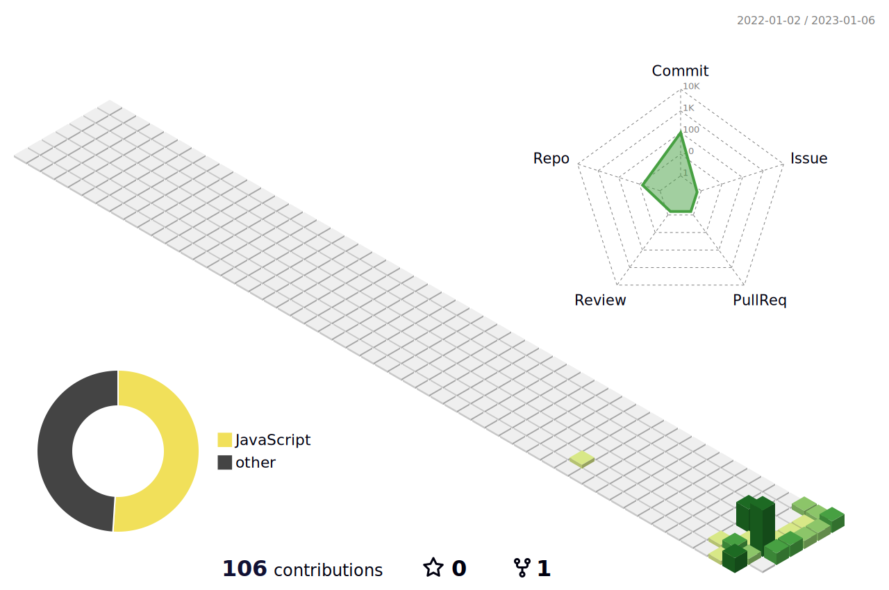

<!--header: move text -->

<!--logoLink -->

&nbsp;

<!-- About you -->
**About Me**

-  name : Sa Seung-yeon / nickname : Daon

-  A passionate front-end developer

-  I’m currently learning Javascript

-  Open for collaborations in Web development

-  I love exploring new tech stack and building cool stuffs.

-  I hope to develop every beautiful things. 

<!--tech stack -->

  
<b>My tech stack</b>

   
<code></code>
<code></code>
<code></code>
<code></code>
<code></code>

<!--github stats -->

  
<b>GitHub Stats</b>

   

<!--commit graph

  
<b>Commit graph</b>

   

 -->
